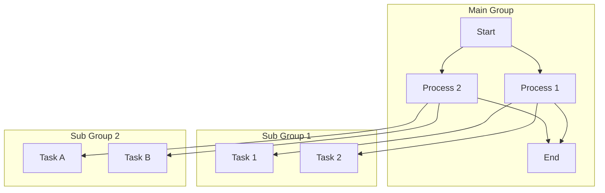
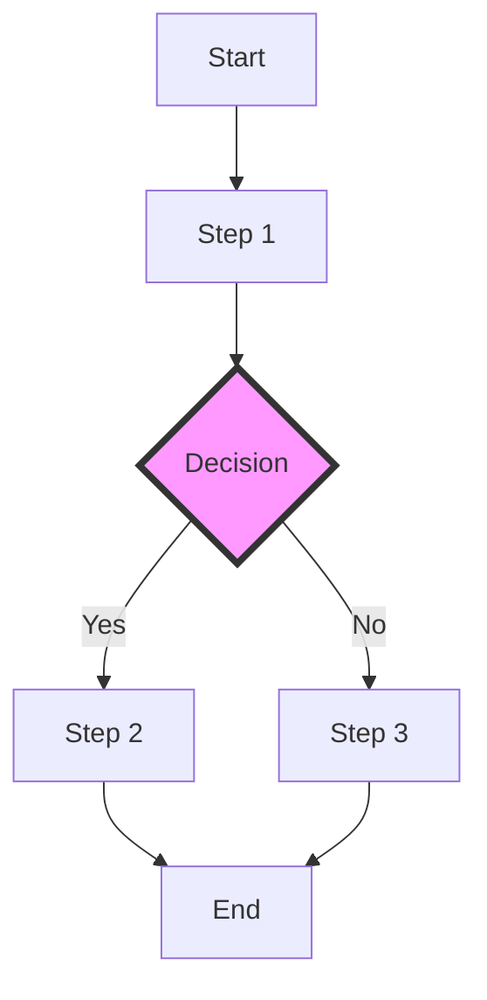
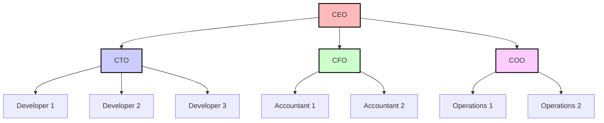

# Usin Rehype Mermaid Plugin

The Mermaid plugin is a powerful tool that enables the creation of diagrams and flowcharts directly within Markdown or HTML content. By integrating this plugin into your workflow, you can seamlessly convert text-based descriptions of diagrams into beautifully rendered visualizations. This is particularly useful for documentation, technical writing, and any content where clear, concise diagrams can enhance understanding.

## Key Features

    * Text-Based Diagram Creation: Allows you to define complex diagrams using an intuitive, text-based syntax within your Markdown or HTML files.

    * Wide Range of Diagram Types: Supports various types of diagrams including flowcharts, sequence diagrams, class diagrams, state diagrams, Gantt charts, and more.

    * Live Rendering: Automatically converts the Mermaid syntax into SVG diagrams during the content processing stage, ensuring that the diagrams are rendered consistently across different platforms.

    * Customizable: Offers extensive customization options for styling and configuring the appearance of diagrams, allowing you to tailor the visuals to match your content’s design.

```bash
# https://www.npmjs.com/package/rehype-mermaid
npm install rehype-mermaid
```

The "pluginName" needs to be exactly "rehypeMermaid"

```typescript

import {Input_SerializeOptions, KatexOptions} from 'ng-mdx-remote';
import rehypeMermaid from 'rehype-mermaid'

mdxOptions: Input_SerializeOptions = {
    scope: {},
    mdxOptions: {
      remarkPlugins: [
      ], 
      rehypePlugins: [
        {pluginName: 'rehypeMermaid', pluginFunc: rehypeMermaid, pluginOptions: {strategy: 'img-svg'} satisfies RehypeMermaidOptions},
      ],
      format: 'mdx',
      development: false
    },
    parseFrontmatter: true,
  };

```

You need to activate the plugin in the component, and you can update the options. Each component can have different options.

```html

  <ng-mdx-remote-render 
  [source]="mdxContent" 
  sourceType="string" 
  [options]="mdxOptions" 
  mermaid
  [mermaid_options]="{strategy: 'inline-svg'}"
  ></ng-mdx-remote-render>

```

## Here are Some Examples using the Plugin

```markdown
graph TD;
  subgraph Main Group
    A[Start]
    B[Process 1]
    C[Process 2]
    D[End]
  end

  subgraph Sub Group 1
    B1[Task 1]
    B2[Task 2]
  end

  subgraph Sub Group 2
    C1[Task A]
    C2[Task B]
  end

  A --> B
  A --> C
  B --> D
  C --> D

  B --> B1
  B --> B2
  C --> C1
  C --> C2
```



```markdown
graph TD;
  A[Start] --> B[Step 1]
  B --> C{Decision}
  C -->|Yes| D[Step 2]
  C -->|No| E[Step 3]
  D --> F[End]
  E --> F

  style C fill:#f9f,stroke:#333,stroke-width:4px
  classDef decision fill:#ccf,stroke:#333,stroke-width:2px;
  class C decision
```



```markdown
graph TD;
  CEO[CEO] --> CTO[CTO]
  CEO --> CFO[CFO]
  CEO --> COO[COO]

  CTO --> Dev1[Developer 1]
  CTO --> Dev2[Developer 2]
  CTO --> Dev3[Developer 3]

  CFO --> Acc1[Accountant 1]
  CFO --> Acc2[Accountant 2]

  COO --> Ops1[Operations 1]
  COO --> Ops2[Operations 2]

  style CEO fill:#fbb,stroke:#000,stroke-width:2px
  style CTO fill:#ccf,stroke:#000,stroke-width:2px
  style CFO fill:#cfc,stroke:#000,stroke-width:2px
  style COO fill:#fcf,stroke:#000,stroke-width:2px
```



