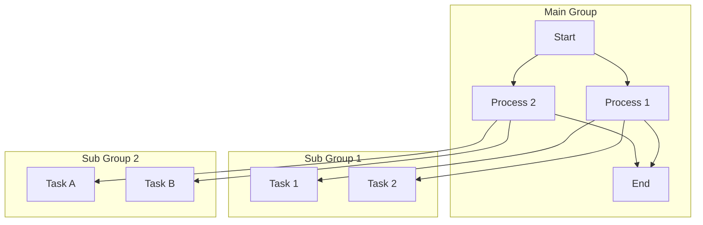
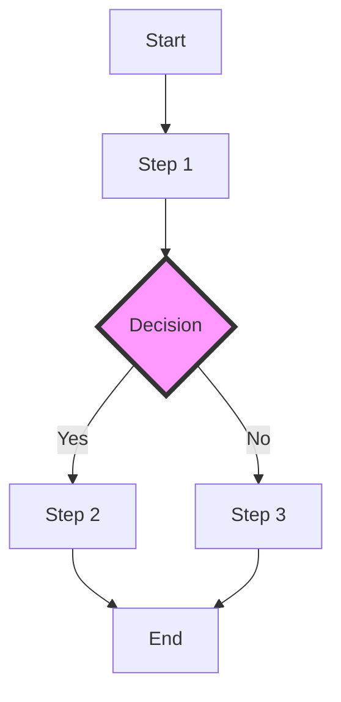
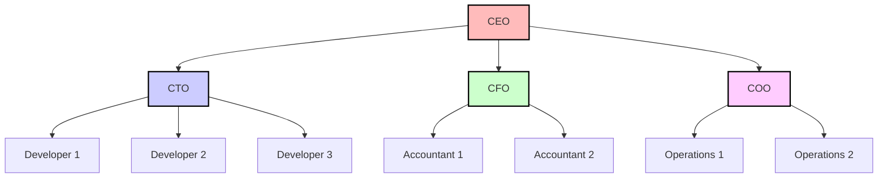

<ng-mdx-nested-code
prismjs
line_numbers
start="4"
line_highlight
line="6, 10-16"
line_offset="5"
>
```css
/* Basic CSS styling for a webpage */
body {
  background-color: #f0f0f0;
  font-family: Arial, sans-serif;
  margin: 0;
  padding: 0;
}

h1 {
  color: #333;
  text-align: center;
  margin-top: 50px;
}

p {
  color: #666;
  font-size: 18px;
  text-align: center;
  margin-top: 20px;
}

.container {
  display: flex;
  justify-content: center;
  align-items: center;
  height: 100vh;
}

.box {
  background-color: white;
  border: 1px solid #ddd;
  padding: 20px;
  border-radius: 8px;
  box-shadow: 0 4px 6px rgba(0, 0, 0, 0.1);
}
```
</ng-mdx-nested-code>

<ng-mdx-nested-code
prismjs
line_numbers
line_highlight
line="2, 4-7"
>
```javascript

// A simple JavaScript function to greet a user
const greet = (name) => {
  return `Hello, ${name}!`;
};

// Use the function to greet the user
const greeting = greet("World");
console.log(greeting);

// Create an array and filter even numbers
const numbers = [1, 2, 3, 4, 5, 6, 7, 8, 9, 10];
const evenNumbers = numbers.filter((num) => num % 2 === 0);
console.log("Even Numbers:", evenNumbers);
```
</ng-mdx-nested-code>

## Gemoji Emojis

Emojis in this text will be replaced: :dog::+1:

I’m so excited for the weekend! :tada::raised_hands:

Just finished a great workout! :muscle::sweat_smile:

It’s a beautiful day outside! :sunny::deciduous_tree:

Happy birthday to my best friend! :birthday::balloon:

Can’t wait to see you tonight! :wave::smiley:

Look, the moon :new_moon_with_face:

Here’s a family :family_man_man_boy_boy:

Слава Україні!  :ukraine:

## Twemoji Emojis

Hello World 👋

Emojis in this text will be replaced: 🐶

I’m so excited for the weekend! 🎉🙌

Just finished a great workout! 💪😅

It’s a beautiful day outside! 🌞🌳

Happy birthday to my best friend! 🎂🎈

Can’t wait to see you tonight! 👋😃

Look, the moon 🌚

Here’s a family 👨‍👨‍👦‍👦

Слава Україні! 🇺🇦









```javascript
(defun factorial (n)
	(if (= n 0) 1
		(* n (factorial (- n 1)))))
```

3. Matrix multiplication:

```math
A = \begin{pmatrix}
a_{11} & a_{12} \\
a_{21} & a_{22}
\end{pmatrix}, \quad
B = \begin{pmatrix}
b_{11} & b_{12} \\
b_{21} & b_{22}
\end{pmatrix}
```
3. Matrix multiplication:

```math
AB = \begin{pmatrix}
a_{11}b_{11} + a_{12}b_{21} & a_{11}b_{12} + a_{12}b_{22} \\
a_{21}b_{11} + a_{22}b_{21} & a_{21}b_{12} + a_{22}b_{22}
\end{pmatrix}
```

```treeview
root_folder
|-- a first folder
|   |-- holidays.mov
|   |-- javascript-file.js
|   `-- some_picture.jpg
|-- documents
|   |-- spreadsheet.xls
|   |-- manual.pdf
|   |-- document.docx
|   `-- presentation.ppt
|       `-- test
|-- empty_folder
|-- going deeper
|   |-- going deeper
|   |   `-- going deeper
|   |        `-- going deeper
|   |            `-- .secret_file
|   |-- style.css
|   `-- index.html
|-- music and movies
|   |-- great-song.mp3
|   |-- S01E02.new.episode.avi
|   |-- S01E02.new.episode.nfo
|   `-- track 1.cda
|-- .gitignore
|-- .htaccess
|-- .npmignore
|-- archive 1.zip
|-- archive 2.tar.gz
|-- logo.svg
`-- README.md
```

## Use remark and rehype Plugins

To enhance your MDX content, you can utilize various remark and rehype plugins. These plugins provide a wide range of functionalities, from processing Markdown syntax to transforming HTML output. In this example, we'll demonstrate how to use the **rehype-prism-plus** plugin for syntax highlighting.

Remark plugins are useful for processing and transforming Markdown content before it gets converted into HTML. They can handle tasks such as parsing frontmatter, converting links to images, or transforming text based on specific rules. Remark plugins operate during the initial stages of the content processing pipeline, making them essential for content preparation.

Rehype plugins, on the other hand, are used to manipulate the HTML output generated from the Markdown content. They can perform tasks like adding custom attributes to elements, sanitizing HTML, or enhancing the output with additional features. The **rehype-prism-plus** plugin is a great example of a rehype plugin that adds syntax highlighting to code blocks in your content.

By combining remark and rehype plugins, you can create a powerful content processing pipeline that enhances your MDX content in numerous ways. This allows for greater customization and control over the final output, ensuring that your content looks and behaves exactly as you want it to.

In summary, using remark and rehype plugins together provides a comprehensive solution for enhancing MDX content, offering both pre-processing and post-processing capabilities. The **rehype-prism-plus** plugin, in particular, demonstrates the power of rehype plugins by adding visually appealing syntax highlighting to code blocks, making your technical content more readable and engaging.


### Poershell Example

```powershell

pwd
/usr/home/chris/bin
ls -la
total 2
drwxr-xr-x   2 chris  chris     11 Jan 10 16:48 .
drwxr--r-x  45 chris  chris     92 Feb 14 11:10 ..
-rwxr-xr-x   1 chris  chris    444 Aug 25  2013 backup
-rwxr-xr-x   1 chris  chris    642 Jan 17 14:42 deploy

```

### Installation

First, you need to install the required packages:

```bash
npm install prismjs rehype-prism-plus
```

```typescript
import { Component,} from '@angular/core';

import {NgMdxRemoteModule,SerializeOptions} from 'ng-mdx-remote'

import rehypePrism from 'rehype-prism-plus';

@Component({
  selector: 'ex-005',
  standalone: true,
  imports: [NgMdxRemoteModule],
  templateUrl: './ex-005.component.html',
  styleUrl: './ex-005.component.css',
})
export class EX_005_Component {
  
  mdxOptions: SerializeOptions = {
    scope: {},
    mdxOptions: {
      remarkPlugins: [
      ], 
      rehypePlugins: [
        rehypePrism
      ],
      format: 'mdx',
      development: false
    },
    parseFrontmatter: true,
  };

  reactComponents = {
  }

  ngComponents = {
  }
}
```

To activate [Prism.js](http://prismjs.com/) syntax highlight you will need to include...
- prism.js core library - `node_modules/prismjs/prism.js` file
- a highlight css theme - from `node_modules/prismjs/themes` directory
- desired code language syntax files - from `node_modules/prismjs/components` directory

_Additional themes can be found by browsing the web such as [Prism-Themes](https://github.com/PrismJS/prism-themes) or [Mokokai](https://github.com/Ahrengot/Monokai-theme-for-Prism.js) for example._

If you are using [Angular CLI](https://cli.angular.io/) you can follow the `angular.json` example below...

```diff
"styles": [
  "styles.css",
+ "node_modules/prismjs/themes/prism-okaidia.css"
],
"scripts": [
+ "node_modules/prismjs/prism.js",
+ "node_modules/prismjs/components/prism-css.min.js" # css language syntax
]
```

```diff
- // Old variable declaration
- const oldValue = 42;
+ // New variable declaration
+ const newValue = 100;
 
- // Old function definition
- function oldFunction() {
+ // New function definition
+ function newFunction(param) {
   // Old function body
-   console.log(oldValue);
+   console.log(newValue, param);
 }
 
- // Old usage
- oldFunction();
+ // New usage
+ newFunction('example');

```

## Code Examples

### JavaScript Example

```javascript

// A simple JavaScript function to greet a user
const greet = (name) => {
  return `Hello, ${name}!`;
};

// Use the function to greet the user
const greeting = greet("World");
console.log(greeting);

// Create an array and filter even numbers
const numbers = [1, 2, 3, 4, 5, 6, 7, 8, 9, 10];
const evenNumbers = numbers.filter((num) => num % 2 === 0);
console.log("Even Numbers:", evenNumbers);

```

### Python Example

```py

# A simple Python function to greet a user
def greet(name):
    return f"Hello, {name}!"

# Use the function to greet the user
greeting = greet("World")
print(greeting)

# Create a list and filter even numbers using list comprehension
numbers = [1, 2, 3, 4, 5, 6, 7, 8, 9, 10]
even_numbers = [num for num in numbers if num % 2 == 0]
print("Even Numbers:", even_numbers)

```

### CSS Example

```css
/* Basic CSS styling for a webpage */
body {
  background-color: #f0f0f0;
  font-family: Arial, sans-serif;
  margin: 0;
  padding: 0;
}

h1 {
  color: #333;
  text-align: center;
  margin-top: 50px;
}

p {
  color: #666;
  font-size: 18px;
  text-align: center;
  margin-top: 20px;
}

.container {
  display: flex;
  justify-content: center;
  align-items: center;
  height: 100vh;
}

.box {
  background-color: white;
  border: 1px solid #ddd;
  padding: 20px;
  border-radius: 8px;
  box-shadow: 0 4px 6px rgba(0, 0, 0, 0.1);
}
```

